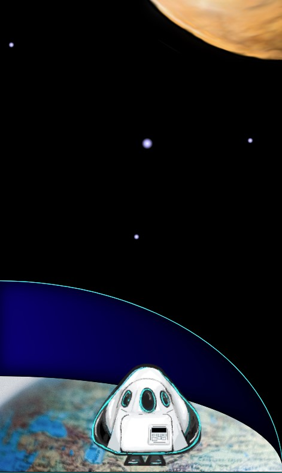

# The Mars adventure

Chingu Solo Project - Tier 1 - The Mars adventure

## Overview

Have you ever wanted to have a journey to space and other planets? guess what, the time has come! In this project, you are going to build a web game to make your spaceship ready for the Mars adventure.

Did you know on July 20, 1969, it was developers who wrote a program to make Apollo 11 ready for landing on Moon!

Complete this fun game and who knows maybe one day you can write a program for a spaceship in NASA! that time will come soon my boy, trust in yourself!

\
## What you will learn?

During this cool game, you will learn about CSS position, CSS 3 animation, and JavaScript!
what are you waiting for?! Move to the mars and sharp your skills!

**Tech Stacks and Resources**

For the Tier one project, you are not permitted to use any frameworks or library it should be vanilla however you can use Normalize.css for the browser compatibility.

## Functionality

**Make the scene ready!**
- [ ] Create a ground (Earth in the screenshot) and position to the bottom
- [ ] On loading the user sees a homepage/start screen which gives the directions for navigating and an introduction to the adventure.
- [ ] Create the spaceship and add it above the ground
- [ ] Create the Mars planet position to the top right

**Make it alive!**

- [ ] Make the spaceship clickable when the player clicks on it
- [ ] Open a modal window that asks the user for the password
- [ ] A lunch button to lunch the spaceship

(If the player enters the correct password lunch the missile, otherwise display an alert with   this message "Alert! security breach!")

**Lift off!**

- [ ] Use the CSS 3 animation to move the spaceship to the moon.

*Tip:* for better UX try to add some transition and add use the `setinterval` function to make animations run smoothly.
